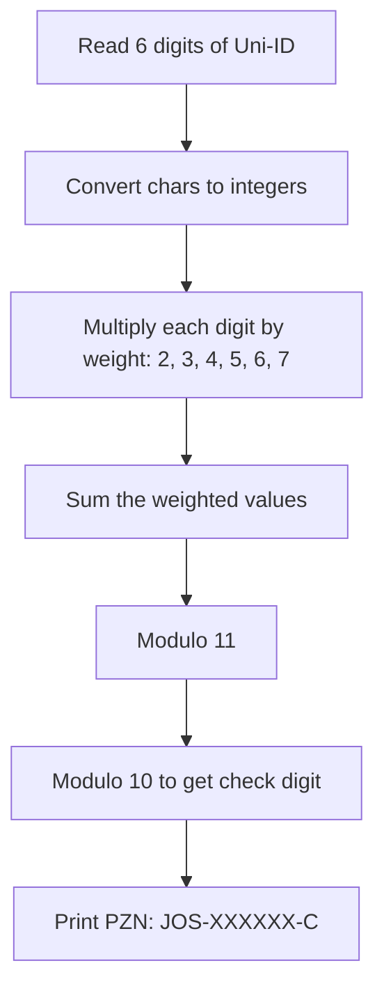

# HSD 01 - Uni ID to Pharma check number Converter | C

A basic programm to convert the Uni-ID into a phamaceutic-Check-Number (PZN in german).

#### Flowchart


#### Code Snippet
```c
  zsum1 = (nummer1-'0')*2;
  zsum2 = (nummer2-'0')*3;
  zsum3 = (nummer3-'0')*4;
  zsum4 = (nummer4-'0')*5;
  zsum5 = (nummer5-'0')*6;
  zsum6 = (nummer6-'0')*7;
  
  summe = (zsum1+zsum2+zsum3+zsum4+zsum5+zsum6);
  mod11 = summe%11;
  pruef = mod11%10;
```
