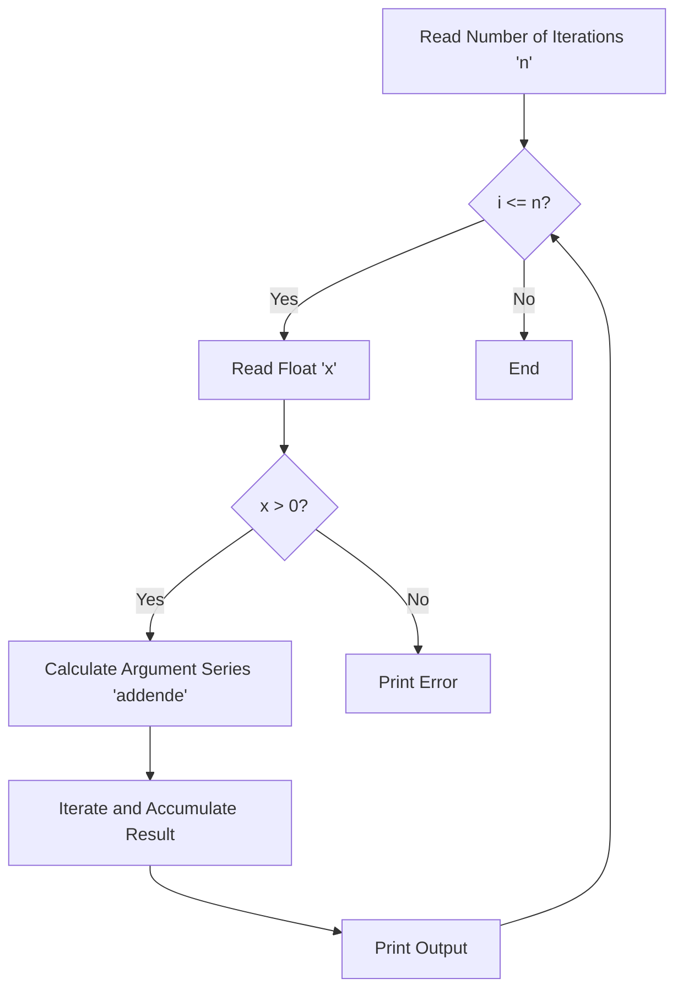

# HSD 02 - Calculator for natural Logarithm | C

A basic programm to calculate the natural Logarithm ln(x) using an iterative series approximation.

#### Flowchart


#### Code Snippet
```c
  while((sumcount<789749%10000)&&((addende>=1.0/789749)||(addende<=-1.0/789749))){
    ergebnis=ergebnis+addende;
    sumcount=sumcount+1;
    minus=minus*(-1);
    potenz=potenz*reiargument;
    addende=minus*potenz/sumcount;
  }
```
