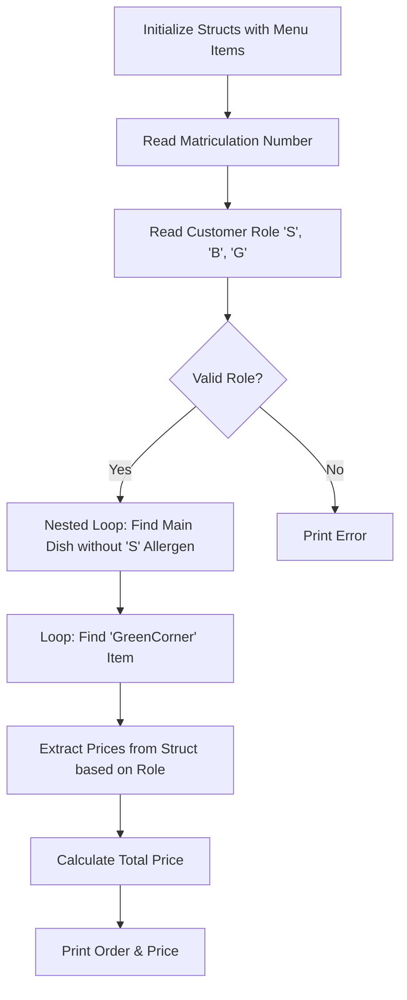

# HSD 03 - Cafeteria Programm | C

This is a basic programm to search a Weekly Menu of a cafeteria based on the date and then calculate the price depending if the costumer is student, teacher or guest.

#### Flowchart


#### Code Snippet
```c
  /*Suchschleife: find valid main dish*/
  for (aussen=0; aussen<11; aussen++){
      for (innen=0;innen<10; innen++){
          if ((jahr_best[9].tageskarte[aussen].hauptgericht==1)&&(jahr_best[9].tageskarte[aussen].kennzeichnung[innen]!= 'S')){
              g_gericht = jahr_best[9].tageskarte[aussen];
          }
      }
  }

  /*preisberechnung*/
  if (pruefung == 'S') preiswahl = 0;
  if (pruefung == 'B') preiswahl = 1;
  if (pruefung == 'G') preiswahl = 2;
```
