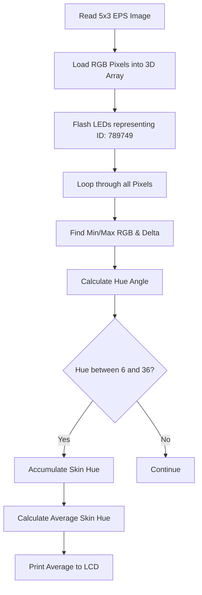

# HSD Bonus Task: Search machine for Pixels in a image and Hue calculation | C

This Project was the Final Bonus excercise in the 1 semester C course I visited at the HSD in Düsseldorf.
The Goal of the project was to create a programm that can display and find Pixel RGB values along the left, upper and right border of a image, mapping them to my Uni-ID: 789749.

#### Flowchart


#### Code Snippet
```c
  cmin = r < g ? r : g; //minimale farbwert berechnung rgb
  cmin = cmin < b ? cmin : b;
  
  cmax = r > g ? r : g; //maximale farbwert berechnung rgb
  cmax = cmax > b ? cmax : b;
  
  delta = cmax - cmin; //unterschied cmin <-> cmax
  
  if (delta == 0) {
    hue = -1;
  }
  else {
    if ( r == cmax ) {
      tmp = ( (float)g - b ) / delta;
    } else if ( g == cmax ) {
      tmp = 2 + ( (float)b - r ) / delta;
    } else {
      tmp = 4 + ( (float)r - g ) / delta;
    }
    tmp *= 60; // Winkel in Grad
```
