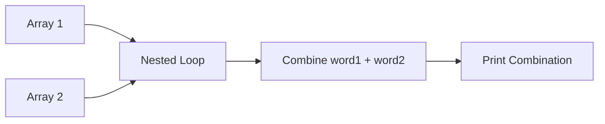
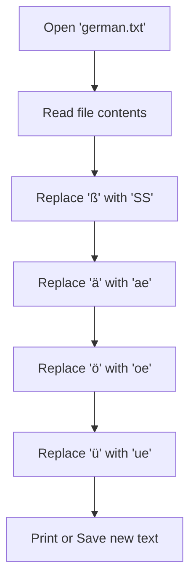

# PA03

### Task 1: Word Combinations
Write a programm that outputs all word combinations of the 2 given arrays.

#### Flowchart


#### Code Snippet
```python
array1 = ["Red", "Green", "Blue"]
array2 = ["Car", "House", "Tree"]

for w1 in array1:
    for w2 in array2:
        print(f"{w1} {w2}")
```

---

### Task 2: Replace Umlauts
Write a programm that reads `german.txt` and replaces all umlauts with the fitting letter pair: ß -> SS, ä -> ae, ö -> oe, ü -> ue.

#### Flowchart


#### Code Snippet
```python
with open("german.txt", encoding="utf-8") as f:
    text = f.read()

text = text.replace("ß", "SS")
text = text.replace("ä", "ae")
text = text.replace("ö", "oe")
text = text.replace("ü", "ue")

print(text)
```

---

### Task 3: Partial String Combinations
Write a programm that outputs all possible partial string combinations of the word: "Humuhumunukunukuāpua‘a".

#### Flowchart
```mermaid
flowchart TD
    A[Define string: word] --> B[Loop i from 0 to length]
    B --> C[Loop j from i+1 to length+1]
    C --> D[Extract substring word[i:j]]
    D --> E[Add to Set to remove duplicates]
    E --> F[Print all substrings]
```

#### Code Snippet
```python
word = "Humuhumunukunukuāpua‘a"
substrings = set()

for i in range(len(word)):
    for j in range(i + 1, len(word) + 1):
        substrings.add(word[i:j])

for sub in sorted(substrings):
    print(sub)
```
