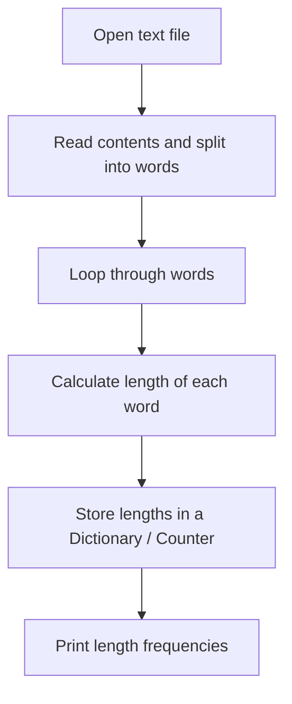
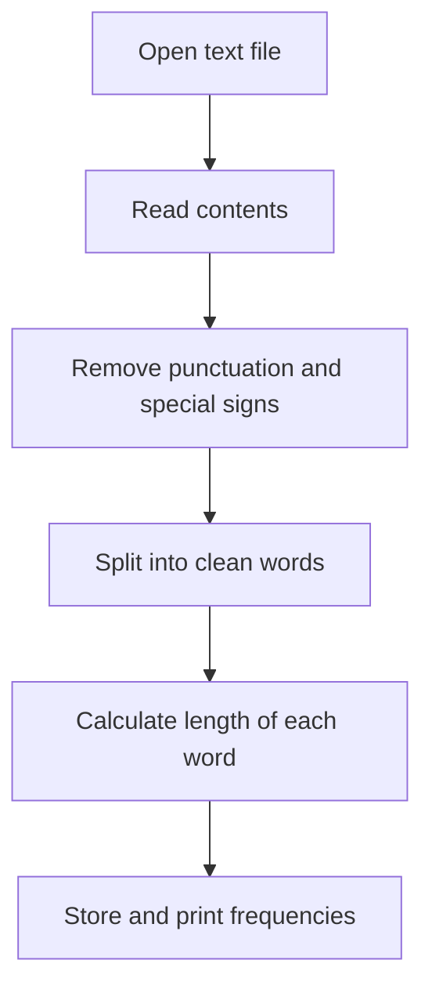

# PA04

### Task 1: Number Statistics
Write a programm that reads `numbers.txt` and then outputs: smallest number, largest number, average and summ of all numbers.

#### Flowchart
```mermaid
flowchart TD
    A[Open 'numbers.txt'] --> B[Read numbers into a list of floats]
    B --> C[Calculate Min: min()]
    B --> D[Calculate Max: max()]
    B --> E[Calculate Sum: sum()]
    E --> F[Calculate Avg: Sum / Count]
    C --> G[Print Statistics]
    D --> G
    F --> G
```

#### Code Snippet
```python
with open("numbers.txt", encoding="utf-8") as f:
    numbers = [float(x) for x in f.read().split()]

print("Min:", min(numbers))
print("Max:", max(numbers))
print("Sum:", sum(numbers))
print("Average:", sum(numbers) / len(numbers))
```

---

### Task 2: Word Length Statistics
Write a programm that reads the attached `numbers.txt` file and outputs statistics about word lenghts.

#### Flowchart


#### Code Snippet
```python
from collections import Counter

with open("numbers.txt", encoding="utf-8") as f:
    words = f.read().split()

lengths = [len(word) for word in words]
stats = Counter(lengths)

for length, count in sorted(stats.items()):
    print(f"{count} words of length {length}")
```

---

### Task 3: Word Length Statistics with Special Signs
Write a programm like task 2, but this one considers special signs.

#### Flowchart


#### Code Snippet
```python
import string
from collections import Counter

with open("numbers.txt", encoding="utf-8") as f:
    text = f.read()

# Remove punctuation
text = text.translate(str.maketrans('', '', string.punctuation))
words = text.split()

lengths = [len(word) for word in words]
stats = Counter(lengths)

for length, count in sorted(stats.items()):
    print(f"{count} words of length {length}")
```
