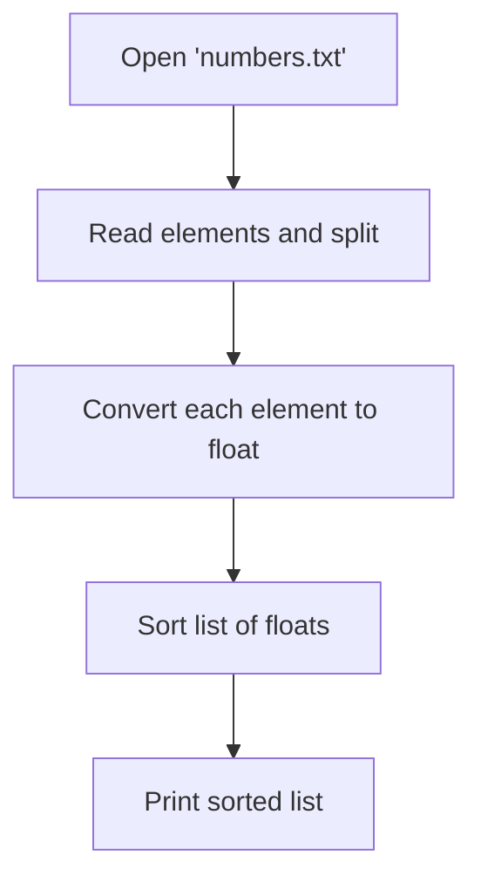
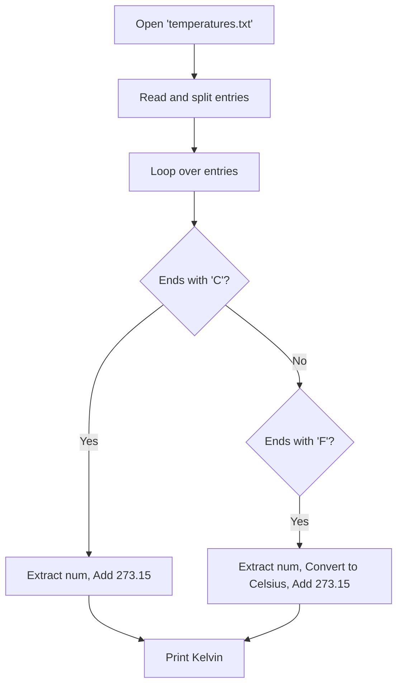

# PA05

### Task 1: Sorting Strings Multiple Ways
Write a programm that sorts the given string 3 times: 1st using the last letter of each word, by letter without considering capitalisation and lastly invert the previous sorting.

#### Flowchart
```mermaid
flowchart TD
    A[List of Words] --> B[Sort by last letter: key=lambda x: x[-1]]
    B --> C[Print List]
    A --> D[Sort case-insensitive: key=str.lower]
    D --> E[Print List]
    A --> F[Sort descending: reverse=True]
    F --> G[Print List]
```

#### Code Snippet
```python
words = ['Tage', 'der', 'Ernennung', 'ihres', 'Sohnes']

# 1. By last letter
words.sort(key=lambda element: element[-1])
print("By last letter:", words)

# 2. Case-insensitive
words.sort(key=str.lower)
print("Case-insensitive:", words)

# 3. Inverted sorting
words.sort(key=str.lower, reverse=True)
print("Inverted:", words)
```

---

### Task 2: Sorting Decimal Numbers
Write a programm that reads `numbers.txt` with decimal numbers, converts them to floats and then sorts them.

#### Flowchart


#### Code Snippet
```python
with open("numbers.txt", encoding="utf-8") as f:
    content = f.read()

numbers = [float(i) for i in content.split()]
numbers.sort()

for item in numbers:
    print(item)
```

---

### Task 3: Temperature Conversion
Write a programm that reads `temperatures.txt` and calculates the Kelvin values from celsius and Fahrenheit out of the list.

#### Flowchart


#### Code Snippet
```python
with open("temperatures.txt", encoding="utf-8") as f:
    temps = f.read().split()

for temp in temps:
    if temp.endswith("C"):
        val = float(temp[:-1])
        kelvin = val + 273.15
        print(f"{temp} -> {kelvin} K")
    elif temp.endswith("F"):
        val = float(temp[:-1])
        kelvin = (val - 32) * 5/9 + 273.15
        print(f"{temp} -> {kelvin} K")
```
