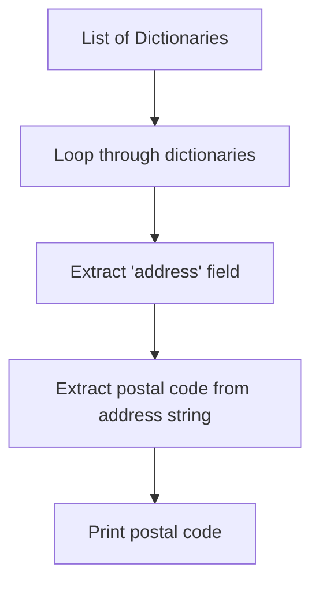
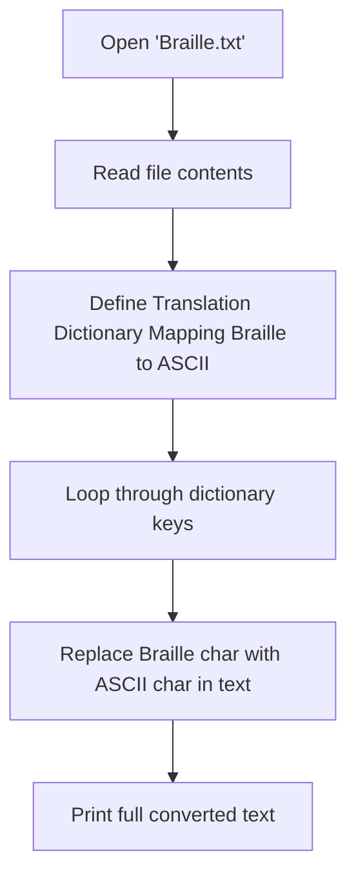
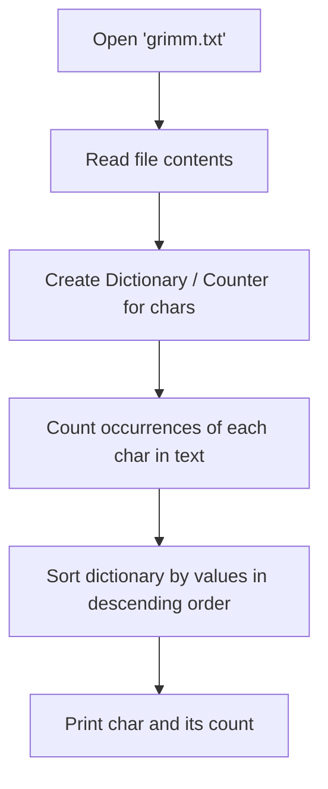

# PA06

### Task 1: Print Postal Codes of Schools
Write a programm that reads the given list containing 10 dictionaries of schools, print the postal codes of each school line by line.

#### Flowchart


#### Code Snippet
```python
schools = [{'address': 'Stolberger Str. 112, 50933'}, {'address': 'Walder Straße 15, 42781'}]

for school in schools:
    address = school.get('address', '')
    # The postal code is typically the last part of the address
    plz = address.split()[-1]
    print(plz)
```

---

### Task 2: Braille to ASCII Converter
Write a programm that reads `Braille.txt` and converts the braille text to ASCII fulltext.

#### Flowchart


#### Code Snippet
```python
with open("braille.txt", encoding="utf-8") as f:
    text = f.read()

char_to_replace = {
    '⠁': 'a', '⠃': 'b', '⠉': 'c', '⠙': 'd', '⠑': 'e',
    '⠋': 'f', '⠛': 'g', '⠓': 'h', '⠊': 'i', '⠚': 'j',
    # ... more mappings
}

for braille, ascii_char in char_to_replace.items():
    text = text.replace(braille, ascii_char)

print(text)
```

---

### Task 3: Character Frequency Counter
Write a programm that reads `grimm.txt` and counts how often each ASCII character is used.

#### Flowchart


#### Code Snippet
```python
with open("grimm.txt", encoding="utf-8") as f:
    text = f.read()

# Using dictionary comprehension to count frequencies
char_counts = {char: text.count(char) for char in set(text)}

# Remove newline counts for cleaner output
if "\n" in char_counts:
    del char_counts["\n"]

# Sort by count (descending)
sorted_counts = sorted(char_counts.items(), key=lambda x: x[1], reverse=True)

for char, count in sorted_counts:
    print(repr(char), count)
```
