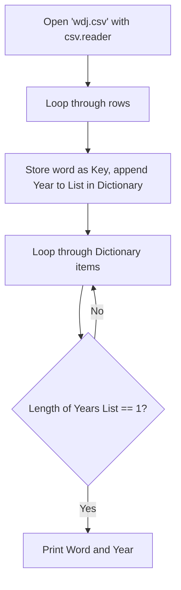
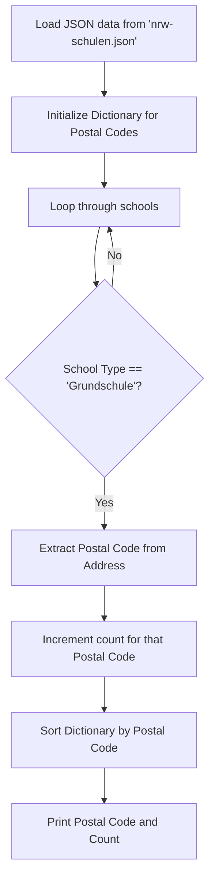

# PA07

### Task 1: Fix Trigram Calculator
Fix a programm that calculates the frequency of trigrams in `grimm.txt` which crashes at the end of the file. The original code loops out of bounds.

#### Flowchart
```mermaid
flowchart TD
    A[Read 'grimm.txt'] --> B[Split into clean words]
    B --> C[Loop i from 0 to length - 2]
    C --> D[Extract word[i], word[i+1], word[i+2]]
    D --> E[Increment trigram tuple count in Dictionary]
    E --> F[Sort by frequency descending]
    F --> G[Print trigrams appearing >= 5 times]
```

#### Code Snippet
```python
# The fix: changed range(len(words)) to range(len(words) - 2)
# to prevent IndexError when accessing nextnextword.

for i in range(len(words) - 2):
    word = words[i]
    nextword = words[i + 1]
    nextnextword = words[i + 2]
    key = (word, nextword, nextnextword)
    trigrams[key] = trigrams.get(key, 0) + 1   
```

---

### Task 2: Words of the Year (wdj.csv)
Write a programm that reads `wdj.csv` (Words of the year) and outputs the words that were not nominated in more than one year.

#### Flowchart


#### Code Snippet
```python
import csv

word_years = {}
with open("wdj.csv", newline='', encoding="utf-8") as f:
    for row in csv.reader(f):
        word, year = row[0], row[1]
        if word not in word_years:
            word_years[word] = []
        word_years[word].append(year)

for word, years in word_years.items():
    if len(years) == 1:
        print(f"{word} {years[0]}")
```

---

### Task 3: Primary Schools in NRW (nrw-schulen.json)
Write a programm that reads `nrw-schulen.json` and outputs the number of primary schools (Grundschulen) per postal code.

#### Flowchart


#### Code Snippet
```python
import json

with open("nrw-schulen.json", encoding="utf-8") as f:
    data = json.loads(f.read())

plz_counts = {}

for school in data:
    if school.get("school_type_entity") == "Grundschule":
        address = school.get("address", "")
        plz = address.split()[-1] # Postal code is usually at the end
        plz_counts[plz] = plz_counts.get(plz, 0) + 1

for plz in sorted(plz_counts.keys()):
    print(f"{plz} {plz_counts[plz]}")
```
