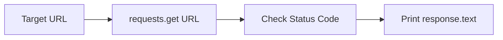
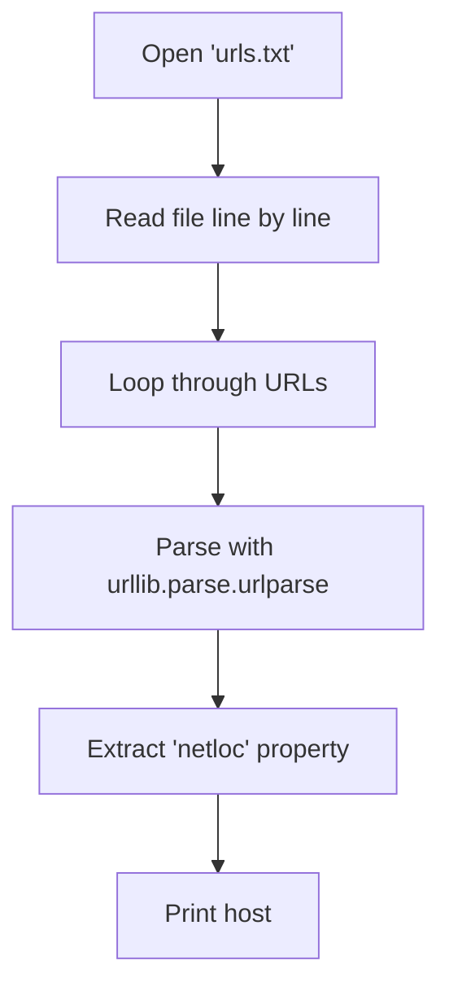
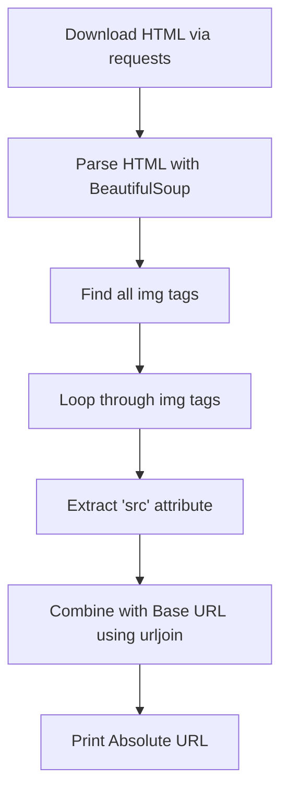

# PA11

### Task 1: Download URL Content
Write a programm that downloads and outputs the content of a URL using the `requests` library.

#### Flowchart


#### Code Snippet
```python
import requests

url = "https://cfbolz.de/stuff/ninformatik/poem.txt"
response = requests.get(url)

if response.status_code == 200:
    print(response.text)
```

---

### Task 2: Extract URL Hosts
Write a programm that reads `urls.txt` and outputs the host of each URL using the `urlparse` function.

#### Flowchart


#### Code Snippet
```python
from urllib.parse import urlparse

with open("urls.txt", encoding="utf-8") as f:
    for line in f:
        url = line.strip()
        if url:
            parsed = urlparse(url)
            print(parsed.netloc)
```

---

### Task 3: Extract Image URLs from Wikipedia
Write a programm that downloads the HTML of a Wikipedia page and outputs the absolute URLs of all `` elements' `src` attributes using `urljoin`.

#### Flowchart


#### Code Snippet
```python
import requests
from bs4 import BeautifulSoup
from urllib.parse import urljoin

base_url = "https://de.wikipedia.org/w/index.php?title=Hunde&oldid=215844884"
response = requests.get(base_url)
soup = BeautifulSoup(response.text, 'html.parser')

images = soup.find_all('img')

for img in images:
    src = img.get('src')
    if src:
        absolute_url = urljoin(base_url, src)
        print(absolute_url)
```
