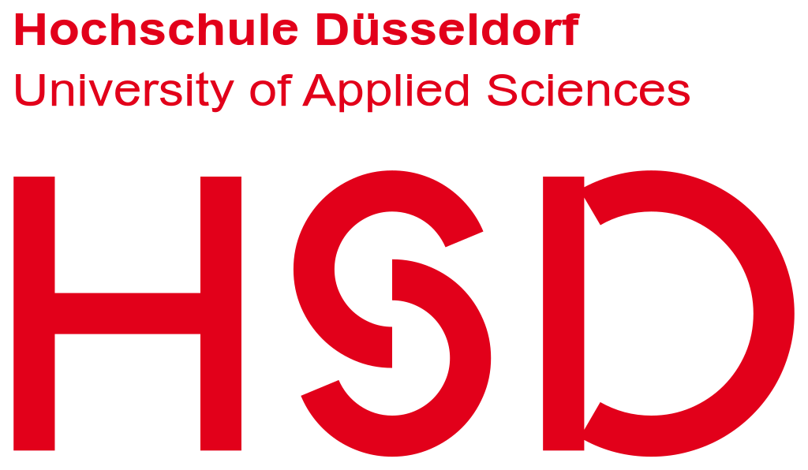

<h1 align="center">Old University Projects</h1>
All my Old Projects I wrote when I visited both the HSD and HHU universities in germany
They are written in C and Python and are uploaded here as backup.
The university specific libraries are missing, so they currently dont run.

 

 

## Table of Contents

<h3 align="center">Projects in C at the HSD University of Applied Science (2018-2019)</h3>

  

Detailed descriptions for each programming assignment (PA) are located in their respective subfolders:

#### [HSD 01 - Uni ID to Pharma check number Converter](./C%20Projects%20at%20HSD%20school%20%282018-2019%29/Project01/README.md)
A C program that converts a university ID into a pharmaceutical check number (PZN). It demonstrates basic character processing and modulo arithmetic.

#### [HSD 02 - Calculator for natural Logarithm](./C%20Projects%20at%20HSD%20school%20%282018-2019%29/Project02/README.md)
A program that calculates the natural logarithm ln(x) using an iterative series approximation. It features looping logic to accumulate series values.

#### [HSD 03 - Cafeteria Programm](./C%20Projects%20at%20HSD%20school%20%282018-2019%29/Project03/README.md)
A program that searches a cafeteria weekly menu based on the date. It then calculates the food price depending on whether the customer is a student, teacher, or guest.

#### [HSD Bonus Task - Search machine for Pixels and Hue calculation](./C%20Projects%20at%20HSD%20school%20%282018-2019%29/ProjectBonus/README.md)
The final bonus exercise that processes an EPS image to find RGB values along the borders and calculates their hue angles.

 

---

 

<h3 align="center">Projects in Python at the Heinrich-Heine University 2022</h3>

  

Detailed descriptions for each programming assignment (PA) are located in their respective subfolders:

#### [PA01](./Python%20Projects%20at%20the%20Heinrich-Heine%20University%202022/Project01/README.md)
Scripts focused on basic file reading and string parsing. It prints words line by line, extracts lowercase words, and filters words based on their starting letters.

#### [PA02](./Python%20Projects%20at%20the%20Heinrich-Heine%20University%202022/Project02/README.md)
Scripts for mathematical operations and character analysis. It computes squared numbers and processes strings to find specific capital words or umlauts.

#### [PA03](./Python%20Projects%20at%20the%20Heinrich-Heine%20University%202022/Project03/README.md)
Scripts that generate word combinations from multiple arrays and replace German umlauts in text files. It also computes all possible partial string combinations of a word.

#### [PA04](./Python%20Projects%20at%20the%20Heinrich-Heine%20University%202022/Project04/README.md)
Scripts that compute basic statistical properties like min, max, average, and sum from numbers. It also analyzes text to produce word length frequencies.

#### [PA05](./Python%20Projects%20at%20the%20Heinrich-Heine%20University%202022/Project05/README.md)
Scripts dealing with advanced list sorting, such as sorting by last letter or case-insensitively. It also handles reading and converting temperature data.

#### [PA06](./Python%20Projects%20at%20the%20Heinrich-Heine%20University%202022/Project06/README.md)
Scripts utilizing dictionaries to extract postal codes and map Braille characters to ASCII. It also features a character frequency counter.

#### [PA07](./Python%20Projects%20at%20the%20Heinrich-Heine%20University%202022/Project07/README.md)
Data processing scripts that parse CSV and JSON files. Tasks include fixing a trigram frequency calculator and counting primary schools by postal code.

#### [PA11](./Python%20Projects%20at%20the%20Heinrich-Heine%20University%202022/Project11/README.md)
Web scraping scripts using the `requests` and `urllib` libraries. It demonstrates downloading URL content, extracting hosts, and finding absolute image links on Wikipedia.
